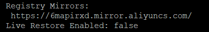

# 安装

## windows

官网下载，一键安装即可。

## linux

### 添加yum源

```bash
sudo yum-config-manager --add-repo https://download.docker.com/linux/centos/docker-ce.repo
```

### 安装

```bash
sudo yum install -y docker-ce
```

### 启动

```bash
sudo systemctl start docker
```

### 开启启动

```bash
sudo systemctl enable docker
```

### docker-compose(可选)

#### pip安装（不推荐）

```bash
yum -y install epel-release
yum -y install python-pip
pip install --upgrade pip
pip install docker-compose
```

可能会提示，遇到安装不了的，根据提示手动安装对应的包后，再继续安装

> Cannot uninstall 'subprocess32'. It is a distutils installed project and thus we cannot accurately determine which files belong to it which would lead to only a partial uninstall.

```bash
sudo pip install subprocess32 --ignore-installed subprocess32
```

### 直接下载(推荐)

```bash
curl -L https://github.com/docker/compose/releases/download/1.26.2/docker-compose-Linux-x86_64 > /usr/bin/docker-compose
```

### 远程连接(可选)

#### 方式一 dockerd命令行参数

```bash
# 添加远程访问端口
dockerd -H tcp://0.0.0.0:2375 -H unix:///var/run/docker.sock &
```

#### 方式二 dockerd启动，daemon.json增加参数

```json
{
  "hosts": ["tcp://0.0.0.0:2375","unix:///var/run/docker.sock"]
}
```

#### 方式三 修改systemctl启动参数(推荐)

> /usr/lib/systemd/system/docker.service

```bash
[Service]
Type=notify
# the default is not to use systemd for cgroups because the delegate issues still
# exists and systemd currently does not support the cgroup feature set required
# for containers run by docker
ExecStart=/usr/bin/dockerd -H tcp://0.0.0.0:2375 -H fd:// --containerd=/run/containerd/containerd.sock
```

> 重启docker

```bash
# 重新加载systemd配置
systemctl daemon-reload
# 重启docker.service
systemctl restart docker
```

# 切换镜像源

官方镜像源在国外，访问比较慢，建议切换为阿里镜像源

## windows

## linux

#### 修改配置

修改/etc/docker/daemon.json，增加如下配置，如果文件不存在则创建

```json
{
  "registry-mirrors": [
    "https://6mapirxd.mirror.aliyuncs.com"
  ]
}
```

#### 重启服务

```bash
sudo systemctl restart docker
```

#### 查看修改结果

修改完成后，可以查看配置

```bash
sudo docker info
```



# 常用命令

docker image build -t tagName:version .

docker container run -dp 8080:80 --name containerName imageName

```bash
# 复制
docker cp containerName:/var/xxx ./xxx
docker cp ./xxx containerName:/var/xxx
```

```bash
# 删除<none>镜像
docker rmi $(docker images -f "dangling=true" -q)
```

```bash
# 强行停止docker daemon，找到对应的PID，kill
cat /var/run/docker.pid
```

```bash
# 连接远程dockerd
docker -H tcp//192.168.13.73:2375 [command]
# 避免每次都指定远程地址，可以设置环境变量DOCKER_HOST
set DOCKER_HOST="tcp://192.168.13.73:2375"
```

```bash
# 可能提示Connection pool is full
vim /usr/lib/python2.7/site-packages/requests/adapters.py
# 修改 DEFAULT_POOLSIZE 10 改为 1000
```

# Q&A

> 容器出现问题已停止，怎么进入查看

将已停止的容器做成镜像，然后运行新的镜像

```bash
docker container commit {container} {image}
docker container run -it {image} /bin/sh
```


# Dockerfile常用指令

## 设置时区

### 方式一：dockerfile

```dockerfile
# 设置时区 unbuntu
RUN ln -sf /usr/share/zoneinfo/Asia/Shanghai /etc/localtime
RUN echo "Asia/Shanghai" > /etc/timezone
# 设置时区 centos
RUN /bin/cp /usr/share/zoneinfo/Asia/Shanghai /etc/localtime
RUN echo "Asia/Shanghai" > /etc/timezone
```

### 方式二：环境变量

TZ: Asia/Shanghai

大部分镜像都支持？

## 复制

```dockerfile
COPY --chown=user:usergroup ./xxx /xxx
```

# docker-compose常用指令

## 启动空的Linux

```yml
# docker conainer run -it
stdin_open: true
tty: true
```

# 私有仓库搭建

```bash
docker run -dp 5000:5000 --name docker-registry -v docker-registry:/var/lib/registry registry
```

## http

```json
"insecure-registries": [registry.mine]
```

## https

将自签名ssl证书放到以下目录 /etc/docker/certs.d/{域名}/xxx.crt

# 使用代理拉取镜像

```bash
set HTTP_PROXY=socks5://127.0.0.1:1080
set HTTPS_PROXY=socks5://127.0.0.1:1080
set NO_PROXY=
```

长期使用，可以设置环境变量在文件中

/etc/systemd/system/docker.service.d/http-proxy.conf

```
[Service]
Environment="HTTP_PROXY=socks5://socks5.sb.sinobest.cn:1080/"
Environment="HTTPS_PROXY=socks5://socks5.sb.sinobest.cn:1080/"
Environment="NO_PROXY=*.aliyuncs.com,*.docker.io,*.docker.com,*.sinobest.cn"
```

