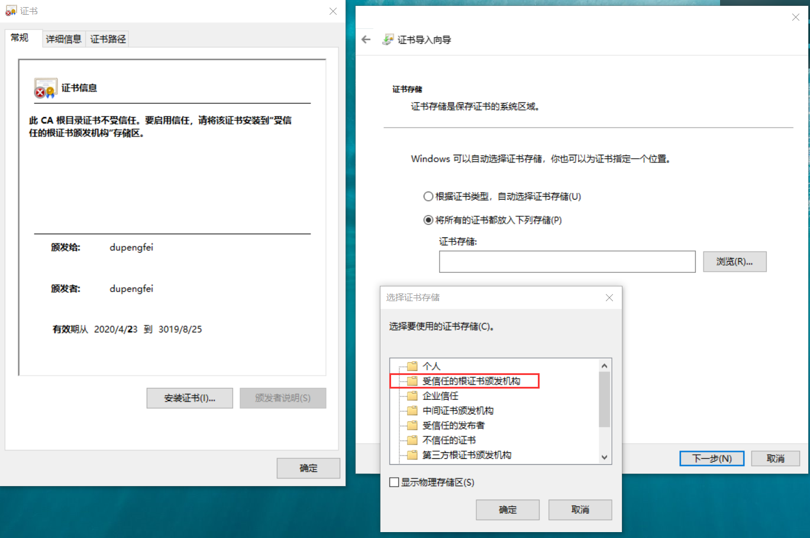

# 自签名证书

```bash
openssl req -x509 -nodes -days 3650 -newkey rsa:2048 -keyout docker.sb.sinobest.cn.key -out docker.sb.sinobest.cn.crt
```

## 添加信任

### windows



### docker for linux

/etc/docker/certs.d/{域名}/证书文件