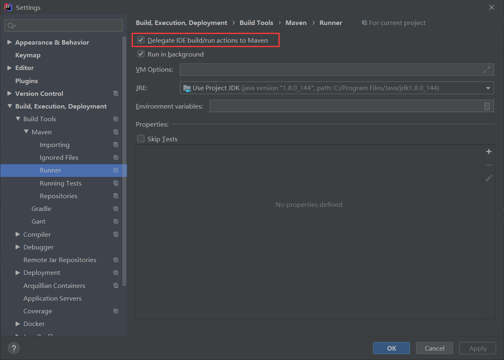

# 安装

下载安装包，解压至任意目录。

添加JAVA_HOME配置

添加PATH配置

# 设置

> .m2/settings.xml

## 使用阿里镜像

```xml
<mirrors>
    <mirror>
      <id>nexus-aliyun</id>
      <mirrorOf>central</mirrorOf>
      <name>Nexus aliyun</name>
      <url>http://maven.aliyun.com/nexus/content/groups/public</url>
    </mirror>
  </mirrors>
```

## 修改本地仓库存储路径

```xml
<localRepository>D:/software/maven/.m2/repository</localRepository>
```

# Q&A

1. dependency未设置scope和version时，默认值怎么处理？

   scope默认为compile,version使用management中的设置，如果没有设置，这会异常报错

2. pom.xml中的引用是怎么处理的，spring boot可以在pom.xml中获取到properties中设置的值

3. IDEA启动不了，但是编译成jar包之后可以启动

   勾选选项 Delegate IDE build/run actions to Maven

   

# 常用命令

## 清理maven仓库

进入仓库根目录后，执行

```bash
for /r %i in (*.lastUpdated) do del %i
```

## 上传私有仓库

```bash
mvn deploy:deploy-file -e -Dfile=D:\文档资料\项目资料\部门\新医保\模板工程搭建依赖\hsa-cep-ivc-local-api-1.2.0-SNAPSHOT.jar -DgroupId=cn.hsa.cep.ivc -DartifactId=hsa-cep-ivc-local-api -Dversion=1.2.0-SNAPSHOT -Durl=http://192.168.13.86:6081/repository/maven-snapshots/ -Dpackaging=jar -DrepositoryId=hsaf-sinobest-snapshots -DpomFile=xxxx
```

```bat
set groupId=cn.hsa.powersi
set artifactId=hsa-powersi-base
set version=1.0.0-SNAPSHOT
set file=D:\文档资料\项目资料\部门\新医保\模板工程搭建依赖\hsa-powersi-base-1.0.0-SNAPSHOT.jar
set pomFile=D:\文档资料\项目资料\部门\新医保\模板工程搭建依赖\hsa-powersi-base-1.0.0-SNAPSHOT.pom
set url=http://192.168.13.86:6081/repository/maven-snapshots/
set repositoryId=hsaf-sinobest-snapshots
mvn deploy:deploy-file -e -Dfile=%file% -DgroupId=%groupId% -DartifactId=%artifactId% -Dversion=%version% -Durl=%url% -Dpackaging=jar -DrepositoryId=%repositoryId% -DpomFile=%pomFile%
```

```
批量上传依赖包至nexus服务器(未验证)
由于nexus 不能访问外网，不能设置互联网依赖包代理，待开发将项目在个人电脑编译通过后将的repository,上传到nexus内网机器上，通过脚本将repository目录下的依赖包批量上传到nexus服务器上。
 
执行命令：nohup /root/mavenimport.sh -u admin -p Test@123 -r http://173.16.184.82:8081/repository/maven-releases/ &
 
nohup /root/mavenimport.sh -u admin -p Test@123 -r http://173.16.184.82:8081/repository/maven-snapshots/ &
 
 
 
[root@host-173-16-184-82 ~]# cat mavenimport.sh  
#!/bin/bash
# copy and run this script to the root of the repository directory containing files
# this script attempts to exclude uploading itself explicitly so the script name is important
# Get command line params
 
while getopts ":r:u:p:" opt; do
        case $opt in
                r) REPO_URL="$OPTARG"
                ;;
                u) USERNAME="$OPTARG"
                ;;
                p) PASSWORD="$OPTARG"
                ;;
        esac
done
 
find . -type f  -not -path './nohup\.out*'  -not -path './mavenimport\.sh*' -not -path '*/\.*' -not -path '*/\^archetype\-catalog\.xml*' -not -path '*/\^maven\-metadata\-local*\.xml' -not -path '*/\^maven\-metadata\-deployment*\.xml' | sed "s|^\./||" | xargs -I '{}' curl -u "$USERNAME:$PASSWORD" -X PUT -v -T {} ${REPO_URL}/{} ;
```

