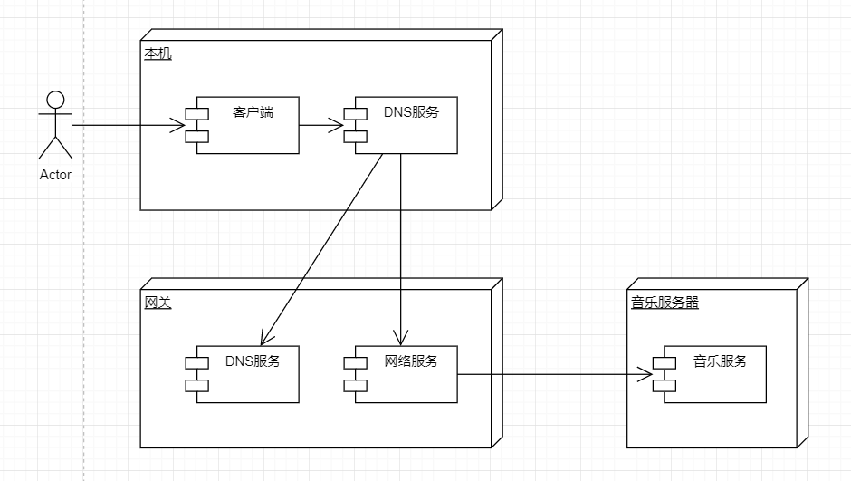
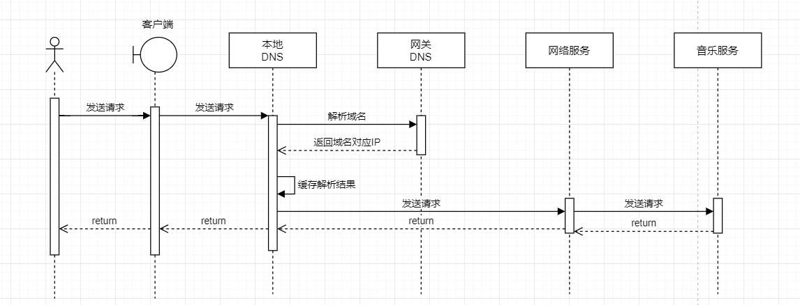
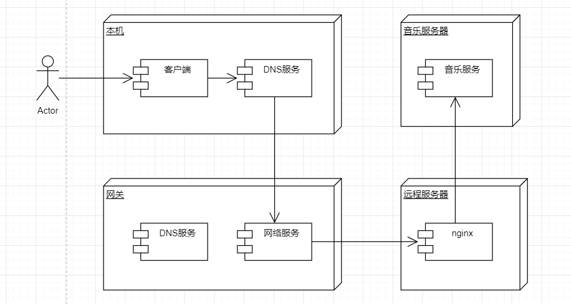
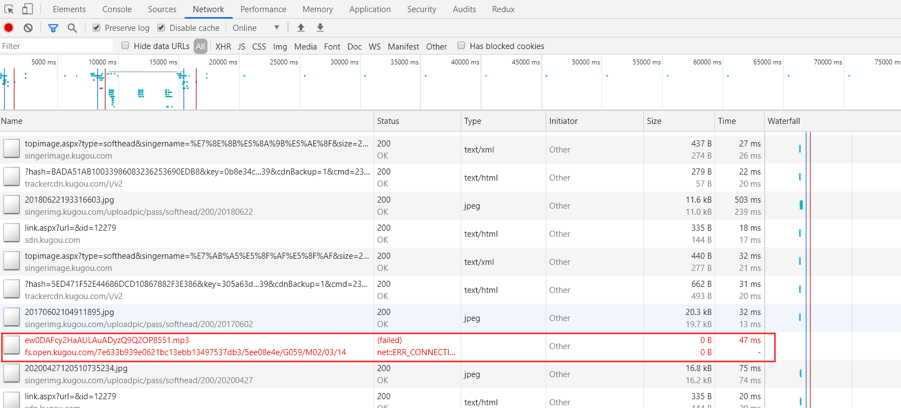
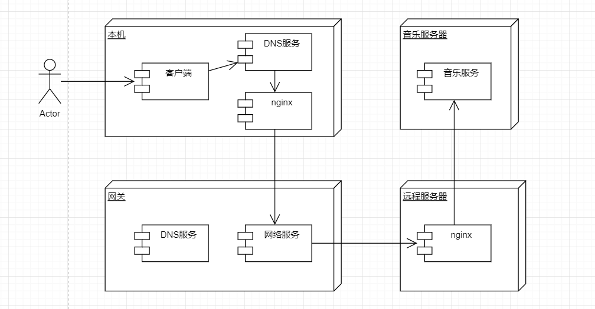
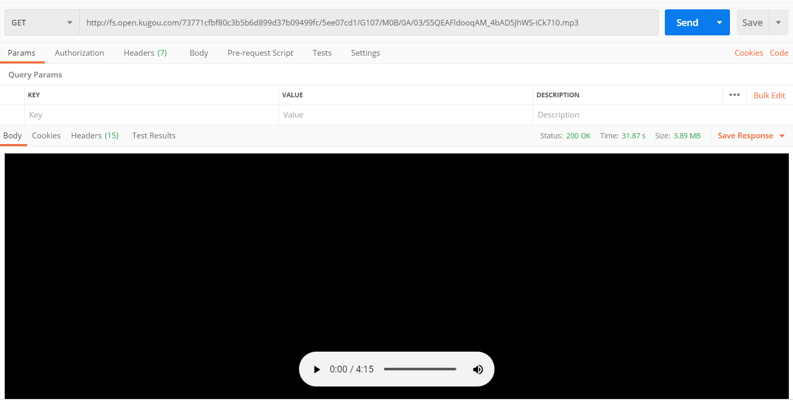

# 功能概要

在公司的网络环境下，无法在线听音乐，有没有办法可以绕过去呢？

# 功能分析

1. 外网可以访问，但播放器却无法获取网络音乐，猜测公司的网络对音乐网站的IP做了特殊处理。
2. 如果使用vpn，将请求先发送到一个允许访问的节点，在这个节点上再将请求转发到音乐网站，是否能解决呢？

# 实现思路

## 现状分析

### 网络部署图



1. 用户在本机发出请求，请求通过网关，转发到音乐服务器。

2. 网关监控到请求需要转发到音乐服务器，因此拦截请求，不允许访问。

### 请求时序图



1. 用户通过客户端发送请求，请求地址为域名地址，需要先通过DNS将域名地址解析为IP地址；
2. 本地DNS没有对应的域名解析记录时，会访问网关的DNS解析，并缓存解析结果；
3. 获取IP地址后，发送请求到网关，网关将请求转发到音乐服务，但是网关发现请求是到音乐服务的，拦截了此请求。

## 解决方案

网关不允许我们访问音乐服务，那我们就增加一个跳板（远程服务器），先请求远程服务器，再通过转发，将请求转发到音乐服务器。

### 网络部署图



1. 配置本地DNS解析，将域名解析到我们的远程转发服务器
2. 远程服务器将请求转发到音乐服务

# 实现方案

## 获取请求

以酷狗音乐为例，发现音乐文件请求失败 



获取请求地址如下

http://fs.open.kugou.com/73771cfbf80c3b5b6d899d37b09499fc/5ee07cd1/G107/M0B/0A/03/S5QEAFldooqAM_4bAD5JhWS-iCk710.mp3

## 配置本地DNS解析

通过修改hosts文件，将域名解析到指定的地址

> C:\Windows\System32\drivers\etc\hosts

```bash
# kugou-vpn,IP为对应的远程转发服务器地址
140.143.146.45 fs.open.kugou.com
```

## 配置nginx实现请求转发

```
location / {
	proxy_pass  http://fs.open.kugou.com;
}
```

## 结果验证

发现通过域名请求还是不行，但是通过远程服务器的IP地址（http://140.143.146.45/73771cfbf80c3b5b6d899d37b09499fc/5ee07cd1/G107/M0B/0A/03/S5QEAFldooqAM_4bAD5JhWS-iCk710.mp3），已经可以获取到音乐服务了。

猜测可能网关对请求的域名也进行了拦截，那么我们就在一层跳板，避免将含域名的请求发送到网关。

# 实现思路（调整）

在本机增加nginx作为转发，DNS将域名解析指向本机，然后由nginx将请求转向远程服务器，此时的请求就不包含域名了。

## 网络部署图



1. DNS服务将域名指向本机IP（127.0.0.1）
2. 本机nginx将请求转发至远程服务器（140.143.146.45）
3. 远程服务器上的nginx将请求转发至音乐服务器（fs.open.kugou.com)

# 实现方案（调整）

## 配置本地DNS解析

> C:\Windows\System32\drivers\etc\hosts

```bash
# kugou-vpn,指向本机nginx
127.0.0.1 fs.open.kugou.com
```

## 配置本机nginx转发

```
location / {
	proxy_pass  http://140.143.146.45;
}
```

## 配置远程nginx转发

```
location / {
	proxy_pass  http://fs.open.kugou.com;
}
```

## 结果验证

