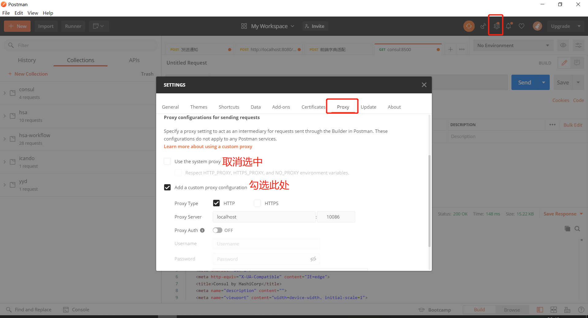

postman本身只支持http或者https代理，因此需要通过http代理软件进行转发

# HTTP代理

## 安装

```bash
npm install -g http-proxy-to-socks
```

## 转发至SOCKS

```bash
hpts -s dev.hsa.sb.sinobest.cn:30997 -p 10086
```

# POSTMAN设置代理



> 不使用代理时，记得恢复哦

