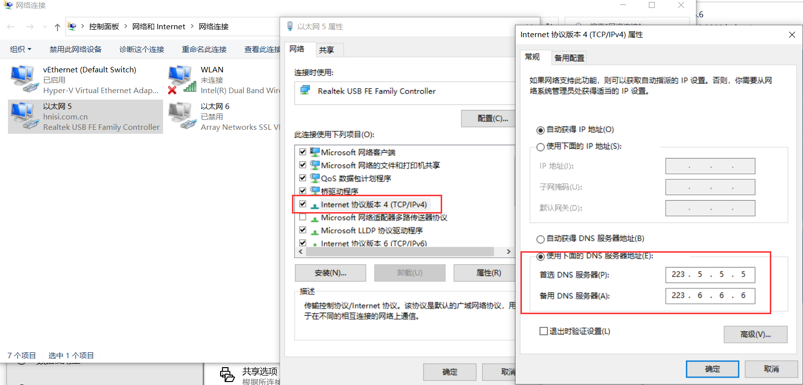

# 背景

访问github时，图片无法查看，需要添加dns解析。手动添加比较麻烦，建议使用阿里的dns解析。

# DNS设置



# DNS常用命令

> windows

```bash
# 显示dns缓存
ipconfig/displaydns
# 刷新dns记录
ipconfig/flushdns
# 重新从DHCP服务器获得IP
ipconfig/renew
```

# HOST路径

C:\WINDOWS\system32\drivers\etc